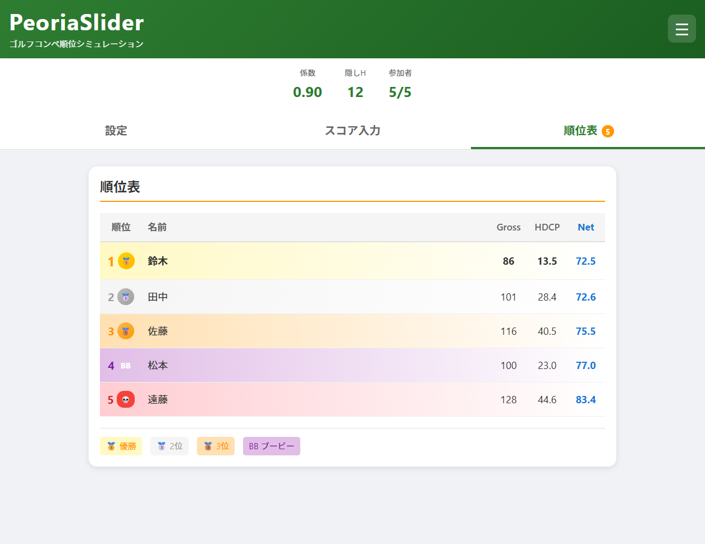

# PeoriaSlider

ゴルフコンペの順位をリアルタイムでシミュレーションできるWebアプリ

**https://peoria-slider.pages.dev/**



## 特徴

- **リアルタイム順位シミュレーション** - 係数スライダーを動かすだけで、順位変動が即座に反映される
- **新ペリア（ダブルペリア）方式対応** - 隠しホール選択、ダブルパーカット、HDCP上限など細かいルール設定が可能
- **PWA対応** - スマホにインストール可能、オフラインでもゴルフ場で使える
- **データ永続化** - ブラウザに自動保存、JSON形式でのエクスポート/インポートにも対応

## デモ

https://peoria-slider.pages.dev/

> 表彰式で「もし係数が0.85だったら...」とスライダーを動かすと、順位がその場で入れ替わる様子を見せることができます。

## なぜ作ったか

ゴルフコンペの幹事をやった際、新ペリア方式の係数を変えたときに順位がどう変動するかを手軽にシミュレーションできるツールがなかった。Excelで計算するのは面倒で、表彰式でリアルタイムに見せる演出もできない。この課題を解決するために開発した。

## 技術スタック

| カテゴリ | 技術 |
|---------|------|
| フレームワーク | React 19 |
| 言語 | TypeScript 5.9 |
| ビルドツール | Vite 7 |
| PWA | vite-plugin-pwa (Workbox) |
| デプロイ | Cloudflare Pages |
| ホスティング費用 | 無料 |

## 技術的なポイント

- **完全クライアントサイド** - バックエンド不要。Cloudflare Pagesの静的ホスティングのみで動作し、ランニングコスト0円を実現
- **PWA + Service Worker** - Workboxによるキャッシュ戦略で、ゴルフ場の電波が弱い環境でもオフライン動作を保証
- **リアルタイム再計算の最適化** - `useMemo`/`useCallback`による計算結果のメモ化と、localStorage保存の300msデバウンスでスライダー操作時のパフォーマンスを確保
- **TWA（Trusted Web Activity）対応準備** - `assetlinks.json`を配置し、将来的なGoogle Playストア公開にも対応可能な設計

## プロジェクト構成

```
src/
├── components/
│   ├── ConfigPanel.tsx    # 係数スライダー・隠しホール設定
│   ├── PlayerInput.tsx    # プレイヤー登録・スコア入力
│   ├── ResultsTable.tsx   # 順位表表示
│   └── HelpModal.tsx      # ヘルプモーダル
├── utils/
│   ├── calculation.ts     # ハンディキャップ計算ロジック
│   └── storage.ts         # localStorage永続化
├── types/
│   └── index.ts           # 型定義
└── App.tsx                # タブ切り替え・状態管理
```

## セットアップ

```bash
npm install
npm run dev
```

## ビルド・デプロイ

```bash
npm run build
# dist/ フォルダをCloudflare Pagesにデプロイ
```

---

ユーザーマニュアルは [docs/manual.md](docs/manual.md) を参照してください。
